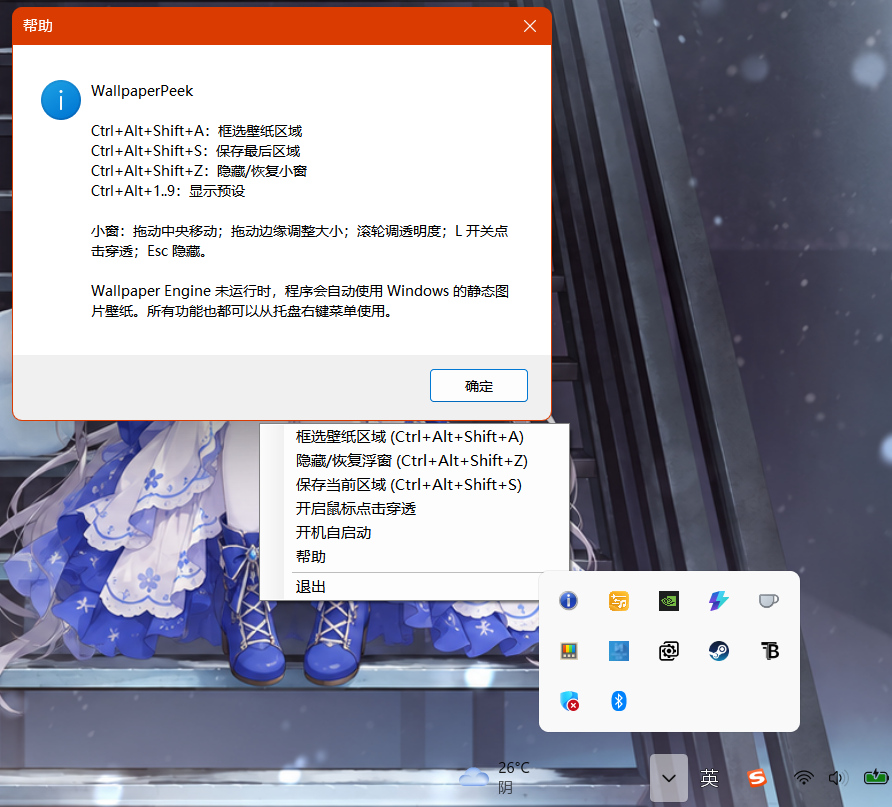

# WallpaperCrop

WallpaperCrop 是一个常驻 Windows 托盘的壁纸局部参考工具：从 Wallpaper Engine 的实时桌面画面框选区域，作为可拖动、缩放、置顶的小窗随时查看。

它适合把壁纸中的公式、课程表、地图、参考图或备忘内容固定在工作区上方，不必切回桌面。Wallpaper Engine 未运行时，工具会自动回退到 Windows 的静态图片壁纸。

> 当前以主显示器为目标。Wallpaper Engine 的 DirectX 渲染窗口会优先被捕捉，普通静态壁纸仅作为回退来源。

## 快速使用

1. 运行 `bin\\WallpaperCrop\\WallpaperCrop.exe`。
2. 按下框选快捷键，拖拽选择壁纸区域。
3. 在预览小窗中拖动中央可移动，拖动边或角可自由拉伸；截图会铺满窗口。
4. 调整到满意的大小后保存为编号预设，以后可一键恢复。

## 演示

### 截取区域


### 保存设置

保存时会记录选择区域和你最后手动调整后的预览宽高。


### 随时使用

已保存的区域可作为置顶参考窗随时恢复。


### 静默托盘启动

程序启动后不显示主窗口，仅在通知区域常驻。



## 键盘说明

| 快捷键 | 操作 |
| --- | --- |
| `Ctrl + Alt + Shift + A` | 框选壁纸区域并显示预览 |
| `Ctrl + Alt + Shift + S` | 保存最后一次框选，选择预设编号 |
| `Ctrl + Alt + Shift + Z` | 显示或隐藏当前预览 |
| `Ctrl + Alt + 1` 至 `9` | 恢复对应编号的已保存预设 |
| `Esc`（预览窗获得焦点时） | 隐藏预览 |
| `L`（预览窗获得焦点时） | 开关鼠标点击穿透 |
| 鼠标滚轮（预览窗内） | 调整小窗透明度 |

右键托盘图标也可完成框选、保存、显示/隐藏、点击穿透、开机自启动和重置操作，不依赖快捷键。

“重置所有设置并清空预设”会关闭当前预览、关闭开机自启动，并清除 `Ctrl + Alt + 1` 至 `9` 的全部保存记录。

## 代码原理与架构

```text
Program（单实例 Mutex）
        |
        v
MainForm（隐藏主窗 + 托盘菜单 + 全局快捷键）
   |          |              |
   |          |              +-- ConfigStore：%APPDATA%\\WallpaperCrop\\config.json
   |          +-- StartupService：当前用户 Run 启动项
   |
   +-- RegionSelector：全屏半透明框选层
   |       |
   |       v
   +-- WallpaperService：Wallpaper Engine 渲染窗口 / 静态壁纸回退抓取
           |
           v
       PreviewForm：无边框、置顶、可移动缩放的预览窗
```

- `Program.cs` 使用命名 Mutex 限制为单实例；重复启动会直接退出。
- `MainForm.cs` 管理托盘、全局快捷键、预设保存、重置和开机自启动开关。
- `RegionSelector.cs` 提供类似截图工具的区域选择交互。
- `WallpaperService.cs` 优先定位 `wallpaper*.exe` 的全屏渲染窗口并读取实时画面；找不到时按 Windows“填充”模式映射静态壁纸。
- `PreviewForm.cs` 将截图作为置顶预览，支持移动、任意边/角拉伸、透明度和鼠标穿透。
- `RegionConfig.cs` 将预设及预览尺寸保存到 `%APPDATA%\\WallpaperCrop\\config.json`。

## 运行与构建

### 直接运行

双击：

```text
bin\\WallpaperCrop\\WallpaperCrop.exe
```

### 开发构建

要求：Windows、.NET 8 SDK。

```powershell
dotnet build
```

### 发布单文件程序

```powershell
dotnet publish -c Release -r win-x64 --self-contained false -p:PublishSingleFile=true -o .\\bin\\WallpaperCrop
```

发布完成后，程序位于 `bin\\WallpaperCrop\\WallpaperCrop.exe`。
